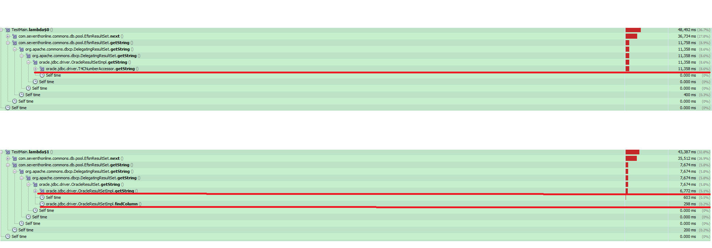

# ARTS WEEK 1st

## *Algorithm*

**LeetCode**: [230. Kth Smallest Element in a BST
](https://leetcode.com/problems/kth-smallest-element-in-a-bst/)

Given a binary search tree, write a function kthSmallest to find the kth smallest element in it.

Note: 
You may assume k is always valid, 1 ≤ k ≤ BST's total elements.

Example 1:  
<pre>
Input: root = [3,1,4,null,2], k = 1
   3
  / \
 1   4
  \
   2
Output: 1
</pre>

Example 2:  
<pre>
Input: root = [5,3,6,2,4,null,null,1], k = 3
       5
      / \
     3   6
    / \
   2   4
  /
 1
Output: 3
</pre>


Follow up:  
What if the BST is modified (insert/delete operations) often and you need to find the kth smallest frequently? 
How would you optimize the kthSmallest routine?  

**Solution:**  

```java
static class Solution {
        public int kthSmallest(TreeNode root, int k) {
            // include currNode.
            int nodeCount = this.nodeCount(root.left) + 1;
            if (nodeCount > k) {
                return this.kthSmallest(root.left, k);
            } else if (nodeCount < k) {
                return this.kthSmallest(root.right, k - nodeCount);
            } else {
                return root.val;
            }
        }
        
        public int nodeCount(TreeNode currNode) {
            if (currNode == null) {
                return 0;
            }
            
            return (1 + nodeCount(currNode.left) + nodeCount(currNode.right));
        }
    }
```

[CodeLink](https://github.com/elvisfool/ARTS/blob/master/src/main/java/bst/KthSmallestElement.java)


## *Review*


[Hash Code Performance Tuning](http://java-performance.info/hashcode-method-performance-tuning/)

对于本文中最后一点, 添加一点个人经历和体会：
<pre>
Try to improve distribution of results of your hashCode method. 
This is far more important than to optimize that method speed. 
Never write a hashCode method which returns a constant.
</pre>

项目中使用到一个数据结构，Key-Value. 代码片段如下: 
```java
public final class Pair<K, V> {
    public final K k;
    public final V v;
    private int hashCode;

    public Pair(final K k, final V v) {
        this.k = k;
        this.v = v;
    }

    @Override
    public int hashCode() {
        int hash = this.hashCode;
        if (hash == 0) {
            hash = this.k.hashCode() * 31 + this.v.hashCode();
            this.hashCode = hash;
        }

        return hash;
    }

    @Override
    public boolean equals(Object obj) {
        //...
    }
}

```
本例子中hashCode计算方式，即避免了上文中描述的"Never write a hashCode method which returns a constant"，在一定程度上提高了hashCode计算时间.
但是，奈何不了，项目中其他人，会把这个玩坏. 比如：

```java
Pair<List<Integer>, List<Integer>> pair = new Pair<>(keyList, valueList);
// ...  省去了keyList, valueList 创建过程.

/// ... operations for pair. hashCode has been calculated.

keyList.add(......);
valueList.add(......);
```

然后，就没有然后了. 改bug吧, 还是贼难发现的那种.

## *Tip*

鉴于下面到Sharing: 脑子是个好东西，还好我有。
Profile工具是必须掌握的，反编译工具也是(虽然现在开源越来越多，使用地方越来越少了).
工具也不是万能的，《深入理解Java虚拟机》专栏里面，基准测试框架JMH多学习一下。

#### **Talk is cheap, show me the code & profile.**

## *Share*

最近，我司做了一次全体DEV的sharing,本人错过了。**WHAT A PITY!** 听同事复述分享内容后,本人做了一次复盘:

Sharing Content: **Retreiving ResultSet(oracle) by column names is slower than by column index.**

嗯,对,也就是,下面这两个方法的性能(以getString做例子):
```java
    /**
     * Retrieves the value of the designated column in the current row
     * of this <code>ResultSet</code> object as
     * a <code>String</code> in the Java programming language.
     *
     * @param columnIndex the first column is 1, the second is 2, ...
     * @return the column value; if the value is SQL <code>NULL</code>, the
     * value returned is <code>null</code>
     * @exception SQLException if the columnIndex is not valid;
     * if a database access error occurs or this method is
     *            called on a closed result set
     */
    String getString(int columnIndex) throws SQLException;
``` 
```java
    /**
     * Retrieves the value of the designated column in the current row
     * of this <code>ResultSet</code> object as
     * a <code>String</code> in the Java programming language.
     *
     * @param columnLabel the label for the column specified with the SQL AS
     * clause.  If the SQL AS clause was not specified, then the label is the
     * name of the column
     * @return the column value; if the value is SQL <code>NULL</code>, the
     * value returned is <code>null</code>
     * @exception SQLException if the columnLabel is not valid;
     * if a database access error occurs or this method is
     *            called on a closed result set
     */
    String getString(String columnLabel) throws SQLException;
```
嗯,然后呢? 编写代码的时候,要用第一个,性能快. :)
Profile? 我没参加会,没看到.参加会议的,也没看到. :) 据说有,是美帝同事做的.
反编译一下源码,很简单就能发现第二个方法比第一个多一步: **findColumn()**. 慢,那是很正常的.听起来很有道理的样子, 都研究到底层JDBC源码内部了.给自己鼓个掌.而且取数据到时候, 1,2,3,4的直接拿数据,简单方便.没毛病,反正自己写的代码,尔等凡夫俗子是读不懂的.

这里是分割线
---

我编不下去了.

Hmmm! 贴一下profile的图(20M rows data, retrieve data 100M times). 认真点看, By Label is faster than By Index. 特意贴的这张图. 多次profile中, getString() 耗时基本在8s左右, findColumn() 耗时基本在500ms左右, 不到getString() 的8%. 下图这次, 嗯, 12年老机器,数据量大, 赶巧碰上Old gen GC了. 哎,有这个功夫. 少写点select * from table. 要知道,在这个数据量上, 多写一个字段, 时间会多不少(基于本例子,增加一个字段,getString()耗时增加到11s),懒得上图了.


Hmmm! 有空可以多研究一下(JDK8 above, single thread),StringBuilder, StringBuffer, String + 性能. 鼓掌! :)